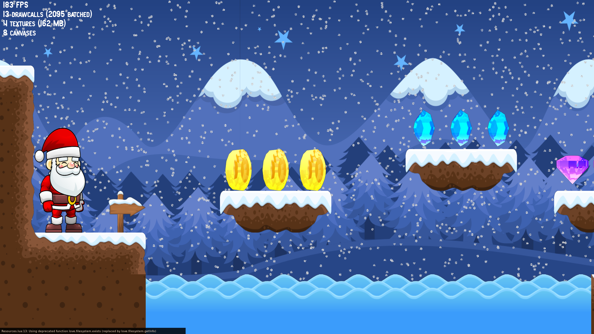

## About
*Papá Noel* - Spanish for Santa Claus- is s simple 2D plattformer.




Currently this is just a tech demo and work in progress.
You are very welcome to contribute to this project!

# Installation
1) Check out the repository from Github:
``` bash
git clone https://github.com/bkuolt/PapaNoel.git PapaNoel
```
2) Go to the `PapaNoel` directory and run the installer:
```bash
cd PapaNoel
make
```
3) *Papá Noel* can now be started with:
```bash
make run
```

## Dependencies
For those interested, here the list of dependencies that are automatically installed by the instalation script `install.sh`:
* [LÖVE](https://github.com/love2d/love)
* [lua.json](https://github.com/rxi/json.lua)

# Running the Game
Go to the directory to which you downloaded the git repository and simply run
```bash
make run
```
to start the game.

# Controls
This sections gives a brief description of the key bindings.
|Key|Function|
|-|-|
|Esc| Exit game|
|P  | Pause/Resume game |
|B  | Show/hide bounding boxes|
|Space| Enable/Disable level editor mode|

#  Development & Code Insights
You can find code documentation and plans for future improvements in the `doc` directory.

# Future Improvements
**TODO**

# Notes
Please note that this project is still work in progress. [Send feedback!](mailto:bastian.kuolt@gmail.com)