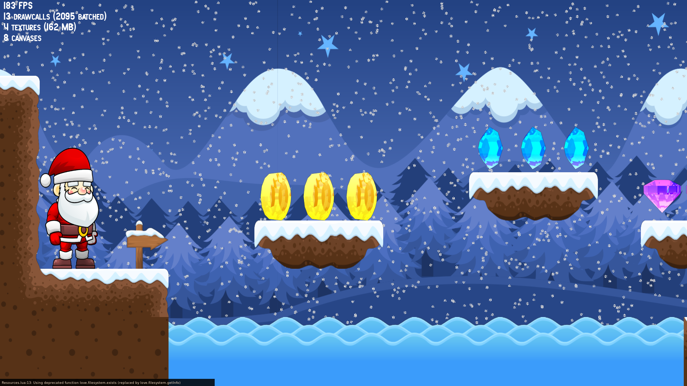

## About
*Papá Noel* - Spanish for Santa Claus- is a prototype for a simple 2D Plattformer.




# Installation
Download the source code and install [LÖVE]([Löve2D](https://love2d.org)):
``` bash
git clone https://github.com/bkuolt/PapaNoel.git PapaNoel
cd PapaNoel
./install.sh
```

# Running the Game
``` bash
./play.sh
```

# Controls
|Key|Function|
|-|-|
|Esc| Exit game|
|P  | Pause/Resume game |
|B  | Show/hide bounding boxes|
|Space| Enable/Disable level editor mode|